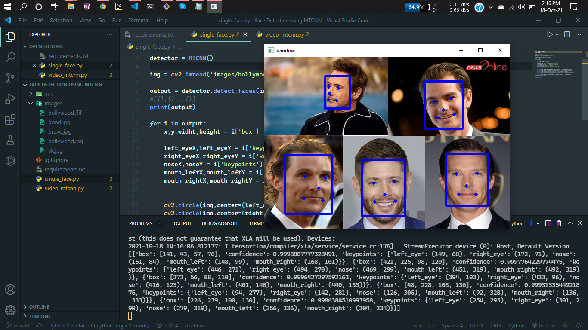

# Face Detection and Alignment using Multi-task Cascaded Convolutional Networks (MTCNN)

Face recognition is the problem of identifying and verifying people in a photograph by their face.
It is a task that is trivially performed by humans, even under varying light and when faces are changed by age or obstructed with accessories and facial hair. Nevertheless, it is remained a challenging computer vision problem for decades until recently.

Deep learning methods are able to leverage very large datasets of faces and learn rich and compact representations of faces, allowing modern models to first perform as-well and later to outperform the face recognition capabilities of humans.

# Paper Link of MTCNN:

https://arxiv.org/ftp/arxiv/papers/1604/1604.02878.pdf

# Blog link How Does A Face Detection Program Work?

https://towardsdatascience.com/how-does-a-face-detection-program-work-using-neural-networks-17896df8e6ff


# Demo:





# Authors:
```bash
Author: Bappy Ahmed
Data Scientist
Email: entbappy73@gmail.com
```


